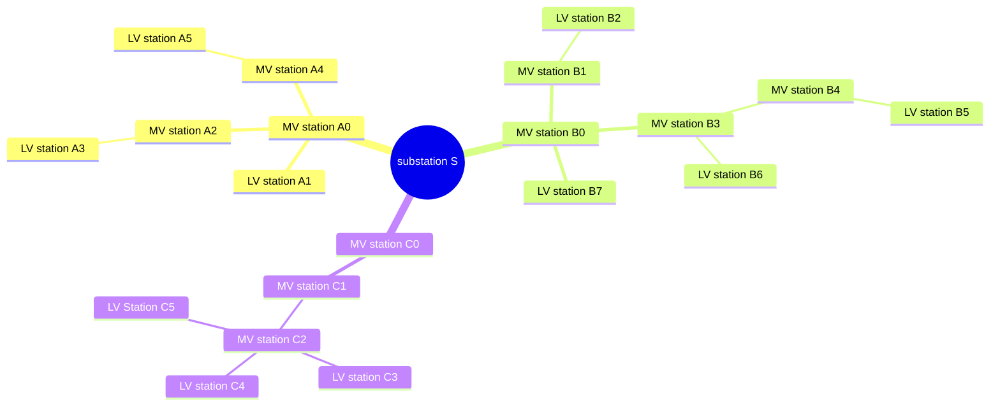

[[./Copyright and Usage|previous]] [[../2 Version And Release Information/Version Information|next]]
# Introduction

The NetCon model and its logic have been created by Spatial Eye to **reason about networks** and provide **a single source of truth for network information** in the organisation. Networks can be electricity, gas, water, heath, sewage or telecom networks, or other commodities that can be transported.

![[../Zimages/example_electricty_network.png|example_electricty_network.png]]

Examples of reasoning about a network are:
- **Digital twin:** does continuous calculations to know the current state of the network and which simulates new states of the network;
- **Advanced Distribution Management System: (ADMS)** is used for daily operation of the grid;
- **Outage Management System:** is used for monitoring, fault diagnoses and service restoration.

Typically, networks are represented as a graph. Below an example is shown. This graph is non-directed and 'single' in nature (a radial network) as opposed to 'multi' graphs that have several connections between nodes forming loops (for meshed networks).

Please note that the text and programs in NetCon are protected by [[./Copyright and Usage|previous]].