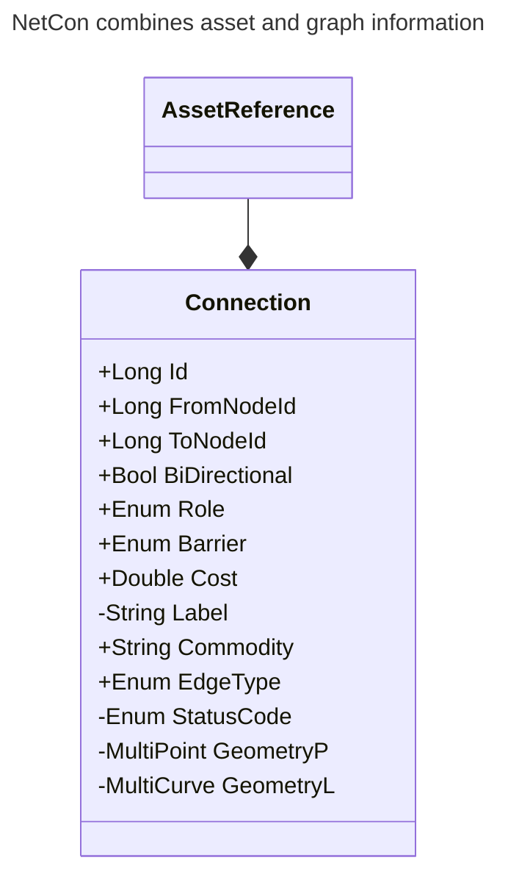

[[./Sources of Connectivity|previous]] [[./Commodity|more]] [[./Network Ontology|next]]
# Commodity Networks

NetCon is all about networks, but not just any network. It reasons about networks that transport a [[./Commodity|more]]. It is setup in such a way that for each type of network specific behavior can be exhibited.

## Disiplin

As networks in NetCon we consider the following disciplines:

| Code | Disciplin        | Remark                                                                               |
| ---- | ---------------- | ------------------------------------------------------------------------------------ |
| U    | Unknown          | Unknown or generic network                                                           |
| E    | Electricity      | Electricity network                                                                  |
| G    | Gas              | Gas network                                                                          |
| W    | Water            | Water network                                                                        |
| H    | Heat             | Network for city heating                                                             |
| S    | Sewage           | Sewage network                                                                       |
| T    | Telecom          | Telecom network, such fibre glass, gsm, coax, copper, ethernet or wifi               |
| R    | Roads            | Road network, possibly with pavements, cycle paths, highways, etc.                   |
| P    | Public Transport | Public transport network such as railways, trams, bus services                       |
| C    | Container        | Container or structure network, which connections contain bundles of other networks. |

## From Asset to Connection

In NetCon, all connectivity and switching or routing behavior is stored directly in the [[../6 Use/DataModel/NetCon Connection|NetCon Connection]]. Therefore, in principle, no other information is needed to reason over the network than the connection table. 

What the network is conducting or transporting is stored in the [[./Commodity|more]] field. Examples are high pressure or low pressure gas, optionally followed by what type of gas (e.g. methane or hydrogen). Another example is low, medium or high voltage power, optionally followed by phase information.

When the commodity is switched of or stopped, the network connection that does this is called a **barrier**. More about this can be read in [[./Barrier or Operational State|Barrier]].

The commodity is transported through the network. While it is being transported, it will experience a certain resistance, which is expressed by the **cost**. For an electricity network, the cost is typically expressed as **impedance**, whereas for others it is called **resistance**. For now, the cost is just stored as a number of double precision and it defaults to the length of a connection.

If the source registration system records assets that have switching behavior, then those will result in connection(s) with the [[../6 Use/Enumerators/NetCon Barrier Enumerator|NetCon Barrier Enumerator]] set to a value other than 0.
Operating barriers to stop or enable the flow, would be equivalent to setting the cost to infinitely high or back to normal cost. We prefer not to do those changes. Instead, we mark connections that are used for switching the network as barriers.
Typically, the default network state is stored in the [[./Barrier or Operational State|Barrier]] property and actually override barrier values can be kept in a near real-time store. This limited number of overrides can be passed on to the engine that reasons with the network connectivity.

The connection has a **role** in the network with regards to the commodity, which can be one or more of: transport provider, source (sometimes called origin), sink (sometimes called service point, end point or house connection). Possible values are described [here](Commodity%2520Networks.md##netcon-role-enumerator).

The connection may not yet be available which is expressed as the life cycle status in [[../8 API/Results/Connection Or Path Results/Status|Status]] code, e.g. it can be planned or be out put out of service. More about this can be read in [[./Life Cycle Status|Life Cycle Status]].

It is possible that a single assets results in several connections, both for link and for node assets, as we will describe subsequently in [[./Referential Information|Referential Information]].

When an asset is described as a line asset, e.g. a cable, fiber, conduct, protection pipe, these will result in one or more connections. A line asset can have several interactions along it route. Each of those interaction points, as well as the ends, will result in nodes. Depending on the source system, also some redundant, 'left over' or 'dummy 'nodes can exist. A line asset will result in a string of connections, all connected by their from_node_ids and to_node_ids into a single line (or path in graph theory). These will have an [[../8 API/Results/Connection Or Path Results/EdgeType|edge type]] = 1, meaning it came from a line asset.

When an asset is described as a point asset, e.g. a fuse, a device, a valve, a switch, a cross-connection or a T-piece, these will result in one or more connections. At a minimum, they will result in a single connection with the same from_node_id and to_node_id. This will have an [[../8 API/Results/Connection Or Path Results/EdgeType|edge type]] = 0, meaning it came from a point asset.

In addition, points asset can have an attribute that it want to connect to the network via [[./Terminal|Terminal]]s. When this is the case, no connection from a line asset will connect to the connection representing the point asset directly. Instead, there will be terminals generated in between. Terminals have [[../8 API/Results/Connection Or Path Results/EdgeType|edge type]] = 2.

In addition, if several points assets are located on, i.e. they are sharing, the same node in the source system, one could argue that this may be convenient from the registration perspective, i.e. when it is a top-view, but that this is not according to reality. For example, when two valves are drawn on top of each other in the GIS, this is not according to reality, when they will never be in the same spot. In such a situation, the **terminals** generation parameter 'needsterminals' can be set such these points assets each will get their own node_id in the connection table. In the case of two valves, both can operate the network and are barriers. The terminators leading from the line assets - most likely a pipe - to the valve, will also be barriers and each go to the respective valve. Clearly, the operating behavior is different now the valves are separated: If valve1 is open, and valve2 is closed, then - because of the terminals, the valve2 connection is not part of the conducting network and is never reached when doing a trace-out.

Some assets are neither point or line assets, and are not part of the geo-spatial network topology, while they are still transporting a commodity. We call those **hyperlinks**. Let's consider three examples.

The first typical example of a hyperlink is the Smallworld hypernode. This magical object has two locations, one in the outside world, e.g. at the end of a cable, and one in an inside world, e.g. attached to a Control. Such a connection is represented by a hyperlink in the NetCon base extraction. The hyperlink is connecting the end of the cable with the Control and in NetCon it does get a geometry.

Another example of the need for hyperlinks is when part of the network is modeled in a schematic, and another part on a realworld-like map. In these cases, certain objects will connect the different network topologies, such as the end of cable in a trench at a substation will be connected by the hyperlink to the Control schematic. This is actually an example of that a relationship that turned into a hyperlink: we are connecting the real-world cable's endcap to the schematic end-cap. Generally stated, when relationship carry important connectivity information that we want to use, we need to turn them into hyperlinks.

A last example of the usage of a hyperlink is when an object has several geometries, for example a T-joint may be branching off the distribution network into the service network. If this is modelled in the registration application by having different geometries for the distribution and service network (or transportation network), then somehow the nodes on these networks need to be connected. The Smallworld tracing engine automatically assumes interconnectivity between all geometries of a single asset, however in the NetCon model this needs to be modeled explicitly. Hence, we create a hyperlink connecting both geometries of this single asset. The advantage of this approach is that we do not included connectivity by accident.
Note that Smallworld connectivity in NRM works a bit different from the normal Smallworld connectivity. A single point can exist for different types of network; and this single geometry point will have different underlying topology points. In this case, you need a hyperlink as well to connect the two different topology points. For example, one can have a transition point (geometry) to connect the transportation to the distribution network. In this case, you will use a hyperlink to connect the two bits of the network.

The connections, including hyperlinks, terminals and barriers, with their from and to nodes, are constituting the entire network. 

For reasoning with the network, we also need to know from where the commodity originates (the source in graph or electricity theory) and where it is consumed (the link in graph theory, the load in electricity theory). Some elements can be both, depending on the time (for example a prosumer or battery storage). This is denoted as the **role** of the connection. Mostly, this will be 1 (role is transport) or 0 (unknown). Sources are denoted by 2, sinks by 4 and combined roles as 6. In theory, a connection that is both a source, a sink and a transport is 7, but we have not encountered that yet.

In order to show the layout of the network, each connection has a point or curve geometry, apart from the terminals, that have none, or the hyperlinks, that optionally have a curve geometry. The geometries are stored according to the underlying storage facility, for now this is a database and it will be spatially indexed.

It can happen that hyperlinks are connecting different sub-networks all over the place which can 'mess up' the functioning of the spatial indices. For that reason, when a hyperlink is longer than 1 km, it will get a short curve at the from-node-id pointing in the direction of the to-node-id. At the side of the to-node-id, there will be a short string of five points (multipoint) pointing toward the from-node-id. This way, the spatial indices keep on working as desired.
Note that the NetCon tracing services reverse this split an produce a long geometry again.

Below you find an example of outside world geographical representations of the network that are connected to inside world schematic substation representation. The color shows how the network is currently operated.

![[../Zimages/operated_sections_outside_to_inside.png|operated_sections_outside_to_inside.png]]

The picture below shows how long hyperlinks are split in a starting line and end points. For example, the five orange dots are the _end_ of a very long hyperlink. The turquoise line is the _start_ of a very long hyperlink.
![[../Zimages/hyperlinks.png|hyperlinks.png]]
