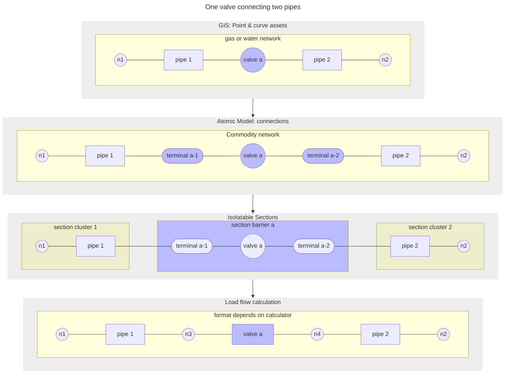

[[./Purpose and Examples|previous]] [[./Data Flow Example 2|Data Flow Example 2]]
# Data flow example I: From GIS valve to simple flow calculation

The picture below illustrates a situation where in the Geographic Information System (GIS, top layer) a valve is connecting two pipes.

In the next layer, the atomic model, which is part of NetCon, every element of the network is stored as a 'connection.' We see here that between the two pipes (now a connection of type 'line') and the valves (now a connection of type 'node') two new connections (of type 'terminal') have been injected. These terminals are required when all switching behavior is done with connections. Another reason to ask for terminals is get nodes with _keys_. Thus, NetCon is used as a keying system.

In the third layer, isolatable sections, also part of NetCon, parts of the network that are switched as one, i.e. parts that can be isolated individually, are clustered together in sections. So, all pipes to the left of the valve will comprise one section, and also all pipes to the right.

Finally, at the bottom layer, is what the output to the load flow calculation program will look like. From pipe 1 and 2, all unnecessary nodes will be removed. And in this case, valve _A_ will be represented as a line, no longer a node, since this particular calculator requires every network switching element to be line, not a node.

---
Example 1: One valve connecting two pipes.
![[../Zimages/example1_onevalve.png|example1_onevalve.png]]

