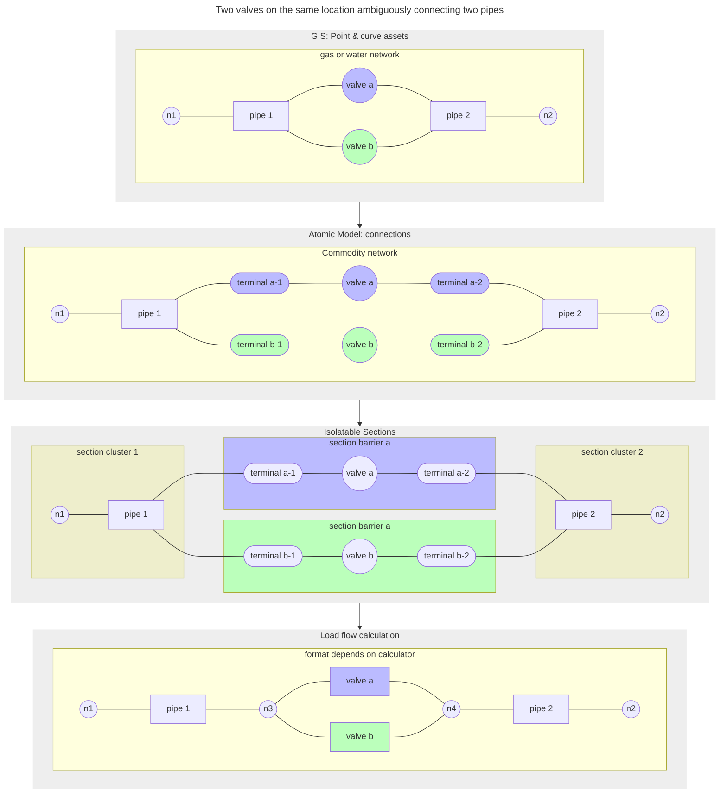

[[./Data Flow Example 1|prevous]] [[./Data Flow Example 3|next]]
# Data Flow Example 2: From ambiguous GIS valves information to flow calculation

The picture below illustrates a variation from the previous example. In this case, in the GIS, two network switching assets are on top of each other, and they are sharing the same location and node. This is not uncommon. It is a data mistake that often occurs, but also, it is an allowed situation for water networks, where a small valve can be used the get the pressure of a large volume stream so a large valve next to it can be operated. In this example, the GIS would just put both valves on top of each other and not model the actual T-joints and extra pipes that are in place to make this work. Let's just say, if it was not required for the registration, often it will not be there.

At the atomic model layer, you see here that the valves are being separated. This is an attribute that can be set in the base extraction configuration. In this case, each of the valves is required to have its own network nodes, and as a consequence, the generated terminals will go to different nodes in the graph.

At the isolatable section layer, between the two sections of pipes that can be isolated individually, now there is an additional section for the second valve - compared to the previous example. Each of the valves(-sections) can be used to create a connection.

Finally, when this exported to a load flow calculator, the pipes become simplified pipes again. At their ends, two T-joints are used to connect to the two valve(-lines). The exporter can just ask every node how many (in- or outgoing) lines are connected to it, and based on that, it can decide to generate a T-joint on the spot; after all, such an object may be needed to split traffic in three ways.  

---
Example 2: Two valves on the same location connecting two pipes.
![[../Zimages/example2_twovalvesontop.png|example2_twovalvesontop.png]]
