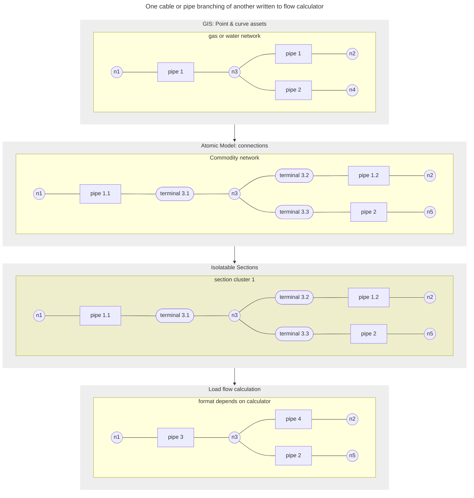

[[./Data Flow Example 2|previous]] [[./Data Flow Example 4|next]]
# Data flow example III: From GIS T-piece to simple flow calculation

In the example below, we have a single continuous asset in the GIS, pipe 1, which is punctured so it can branch off into a different direction, which is pipe 2.

In the atomic layer, the T-piece will split the network. Also, the way that the GIS stores the data, pipe 1 could potentially be stored in more parts introducing unnecessary nodes (sometimes called dummy nodes). It is decided for standardization reasons, which is actually the case by the electric CIM, that terminals are generated for the T-piece.

At the section model, we experience that all of this network is literally glued together and that there is nothing to be isolated, or switched, so this part of the network is all clustered into the same section.

Finally, when exporting to a particular calculator, just the pipes are required. In this case, the calculator is able to derive itself that a T-piece is in place between pipe 1a, pipe 1b and pipe 2.

---
Example 3: One pipe branching of another.
![[../Zimages/example3_tpiece.png|example3_tpiece.png]]