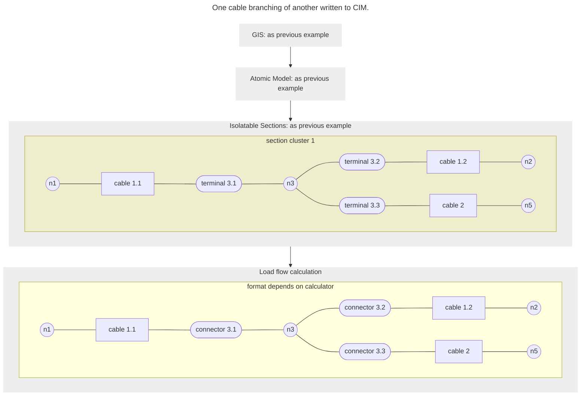

[[./Data Flow Example 3|previous]] [[./Sources of Connectivity|next]]
# Data flow example IV: From GIS T-piece to Common Information Model

The example below is almost the same as the [[./Data Flow Example 3|previous]]. The (gas or water) pipes are now replaced by cables. This time, the network is not exported to a calculator, but towards an ADMS system by means of the CIM format. The CIM format requires terminals between cables and joints, which are called terminals or connectors.

Sometimes, terminals 1a-T and terminals 1b-T are remove from the export. The Spatial Eye Network Reduction can perform network transformation, aggregation and reduction functions based on asset, edge_type, etc. in order to fulfill these requirements.

---
Example 4: One cable branching of another.
![[../Zimages/example4_tjoint_cim.png|example4_tjoint_cim.png]]
