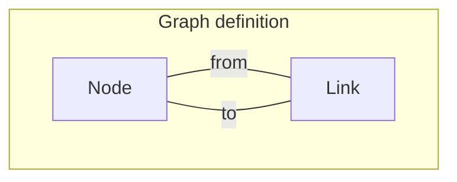
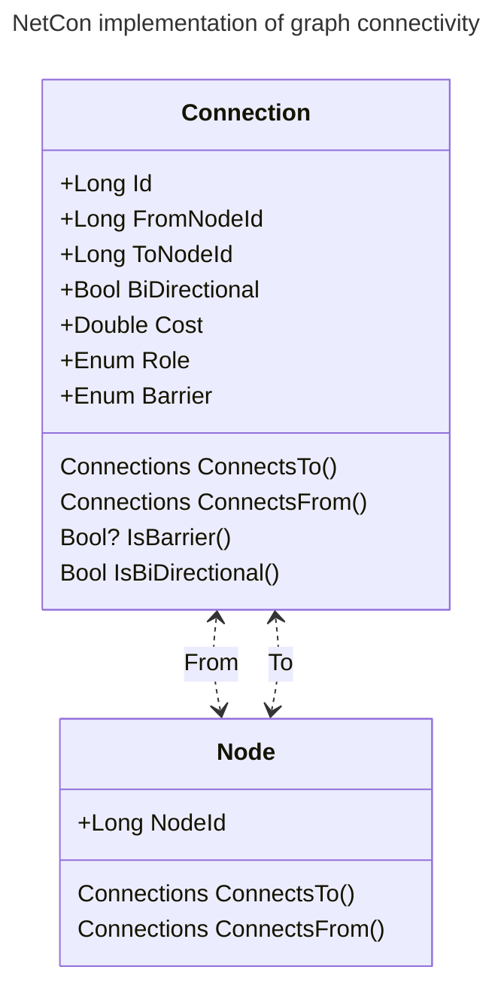
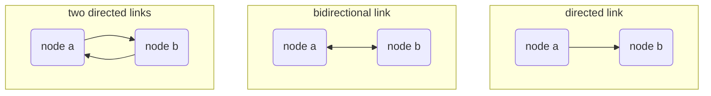

[[./Commodity Networks|previous]] [[./Tracing and Querying/Shortest path or Dijkstra algorithm|next]]
# Network Ontology

The purpose of NetCon is to have a convenient way to reason about the network. Many iterations of different models have been examined and NetCon is the result.

First of all, the common approach to modelling a network as a **graph** has been followed. Every element in the graph is stored as **connection**. This connects two nodes, denoted by a **from_node_id** and a **to_node_id**. This does not mean that every node in the original source network results in a node in NetCon. NetCon mostly likely has many more nodes, as we will see below. The name 'connection' has been chosen because not only because the **links** or **edges** of the source system will result in connections, but other elements will results in connections, as discussed in [[./Commodity Networks|previous]].

NetCon can provide a **node** table, which is for convenience only and also redundant or derived data. The node table is a list of nodes with their point geometries and source node information. From the NetCon perspective, as soon as a **node_id** is used, whether as from or to node, the node exists as well.

One peculiar thing that occurs in some networks is **direction**. A directed connection goes from the from-node to the to-node, but not the other way round. You can think of a directed connection as one with the cost set to infinite to the reverse direction.

Examples of directed networks are: a check valve (water or gas, 'keerklep' in Dutch), a diode in an electricity network, and lasers emitting light in telecommunications.

The default is that **bidirectional** equals 1, which means the commodity flows in both directions, otherwise it is true. One could use the bidirectional attribute and reverse the from- to- node-ids in order to model a network with an **asymetric cost**, which is the exception. (See example 'two directed links' below.)

A connectivity graph of a network is often called a _network topology_, though we will stick to using connectivity in this manual.
