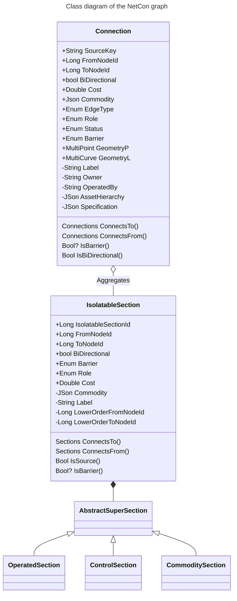
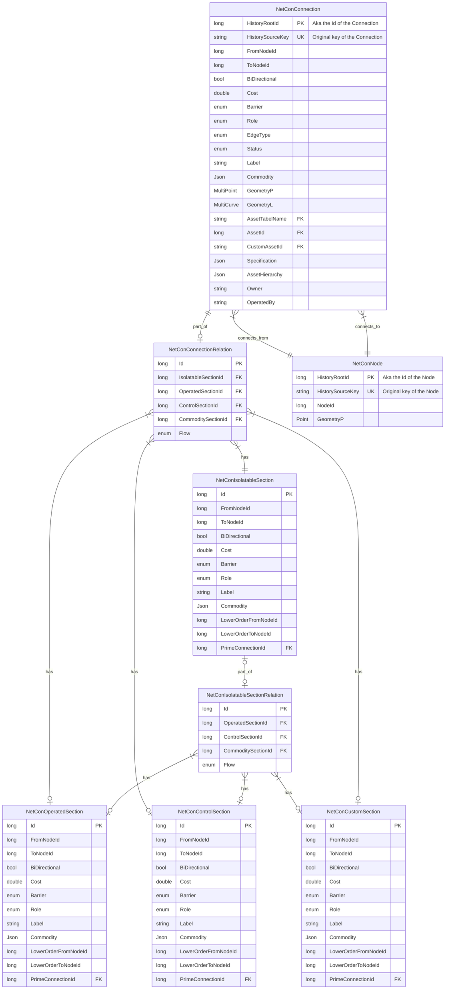

[[./Referential Information|previous]] [[../index#Getting started|next]]
# Clustering the Network into Sections

Part of NetCon model is that the operated network is pre-traced into **isolatable_sections**. An isolatable section is a part of the network that is operated as one: there is no way of supplying the commodity to a smaller part of the network unless the network is broken or cut up. 

Examples of a network being cut up are when an overhead wire is broken by a falling tree, or when a gas network is operated by inserting a blocking balloon. Which connection can be `cut up` are specified by the `cut up` expression on the `NetConBase` feature source. A cut up network will still provide commodity service to the upstream network, whilst

## 1st level higher order or Isolatable Section Network

IsolatableSection is either:
* A cluster of connections that are not barriers nor bidirectional, or
* A singular path of connections that are barriers or unidirectional.

This way, the Isolatable Section Network forms a network in its own right. The non-barrier connection clusters have:
* FromNodeId = ToNodeId

Wherease for the paths of barriers or directed connections holds:
* FromNodeId ≠ ToNodeId

## 2nd level higher order or super sections

The AbstractSuperSection consist of subsets of 1 or more IsolatableSection:
* OperatedSection: Aggregates how the network is currently operated, i.e. determined by if a barrier is barring (a new Operated Section) or conducting (in one and the same Operated Section). Optionally the Operated Sections may split by a change commodity-subnetwork, such as HV -> MV or MV -> LV.
* ControlSection: Aggregates how the network is operated, and in addition it is split by the important barriers (e.g. switches) that follow a particular upstream condition, such as e.g. a busbar, installation, or block.
* CommoditySection: Aggregates how the network is operated, and in addition contains customs splits or upstream conditions.

## Storage into the database
The NetCon 2.0 way to store this in the database is the following:

