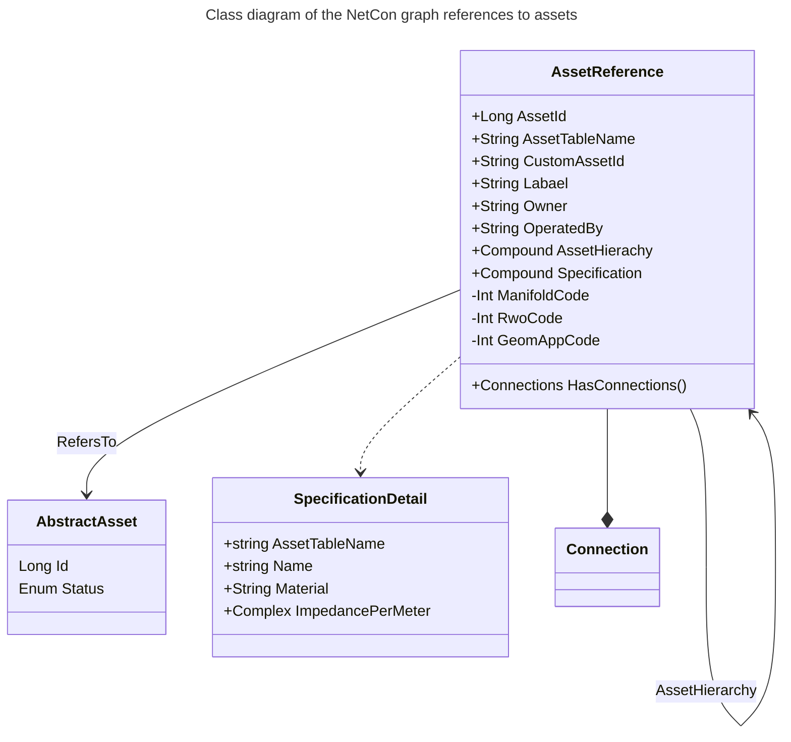

[[./Barrier or Operational State|previous]] [[./Network Sections|next]]
# Referential Information

It is all good and well to have a mathematical graph with which one can reason about a network, however, this is not sufficient. Often, in order to create specific behavior for certain assets, one needs to know about what kind of network element is referred to by the connection. For reasons of performance, all this information is also stored in the connection, rather than working with a reference table.

Note that for fast storage reasons, the Connection and Asset Reference information is stored in one and the same table. See [NetCon Connection](Referential%2520Information.md##netcon-connection).

The asset to which a connection belongs, is referred to by its **asset_table_name** in combination with its **asset_id**. In addition, a free text field **custom_asset_id** exists, which can point to e.g. another registration system such as SAP ISU or it can contain a natural key.

For quick lookup, the gist of 'type' or **specification** information of the asset can be stored in a cache field. That way, when using NetCon, one does not need to jump to different asset tables and their specifications to find relevant information for flow calculations. Note that in the future, the NetCon model may be extended with a union SpecificationDetail table that contains a fast lookup of all specs.

Possibly, the asset that represent the connection is contained in another asset, which in turn can be contained in another asset. For example, a busbar is located in a room in a substation, a fuse is part of a Control, etc. The contains-relationship is modelled in the [[../8 API/Results/Connection Or Path Results/AssetHierarchy|AssetHierarchy]] field.

Some typical attributes that can be relevant to usage and operation of connections, are stored as well on the connection. **Owner** stored the financial owner of the asset, which can be relevant for a usage fee of the network. Furthermore, **operatedby** stores the company that operates (switches, builds, maintains) the connection. This can be relevant because only a certain field crew can operate on certain parts of the network.

Note that these fields can be left empty when they contain the default, e.g. the DSO or TSO that owns and operates most of the network.

