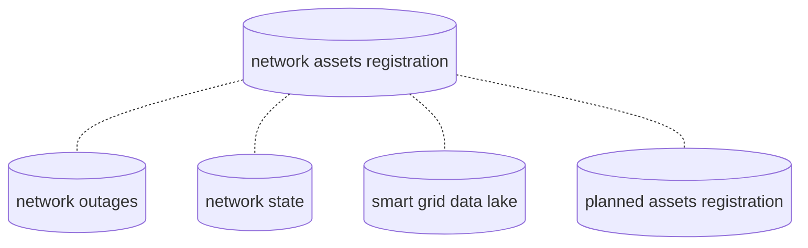

[[./Solution Architecture|previous]] [[./Commodity Networks|next]]
# Four common sources of information for network connectivity

1. The Geographic Information System (GIS). Common systems that register connectivity for network assets, but not limited to these, are GE Smallworld (which has it embedded in the assets and geometry model and therefore tends to have good data quality) and recently also ESRI Utility Network Model. The GIS should has an explicit connectivity model, rather than implicit, which means that connectivity is derived on the fly by applying rules. Typically, the GIS contains service endpoint information and address information, and sometimes even customer information.

2. Current switch and valve state of the network, i.e. the position of all flow determining assets. This could be kept in a ADMS (typical for medium voltage power) or EAMS (for ultra high voltage), a work order system or a field GIS system. Note that Spatial Eye also has a solution for maintaining and synchronizing this (ETL).

3. Outages and interruptions in the network. Outages can be planned (due to maintenance and changes of the as-built network) or unplanned (due to excavation damage or a combination of external and aging influences.) Outages can registered and monitored in an AMDS or a Customer Relationship Management system (CRM), a Work Order Management system. For good risk based asset management, it is important to be able to related outages to time and place (spatial location of the asset) in the network. As such Spatial Eye Warehouse provides a dependable source (time travel can be used in case the asset is split during the repairs, or replaced by a new asset, to avoid replacing a just replaced faulty asset again - which is a waste).

4. Measurement information from the Smart Grid, e.g. Smart Meters or substation near real time measurement information, can be used to diagnose outages and asses the state (e.g. load) of the network.

5. Planning and design system for network maintenance and expansion, e.g. Spatial Eye's NetPlan.

In case you do not have a system for outage and/or network state registration, or you need a buffer system in the IT domain to do Outage Analysis, you can use Spatial Eye's Outage Portal.
Near Real Time differences become part of the traceable and query-able network via [[../5 Configuration/Overlay and Near Real Time Networks/Introduction to Overlay Networks|overlay networks]].
The same applies for the planned assets.
