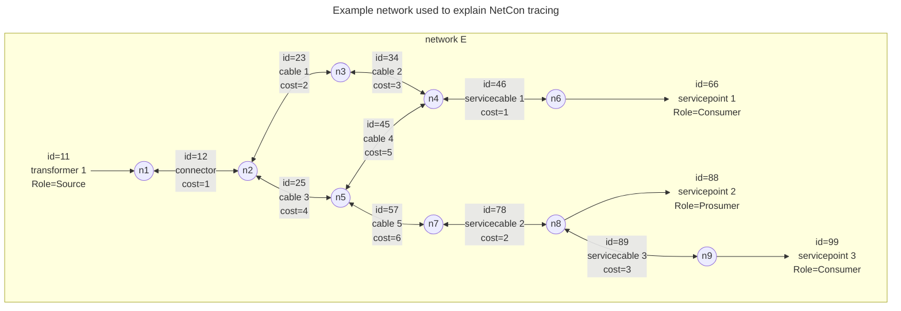
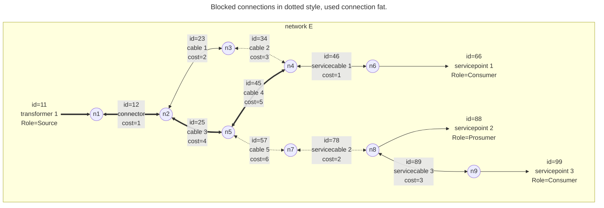

[[./NetCon Path|previous]] [[../Life Cycle Status|next]]
# Basic network tracing

In this paragraph, we will discuss the start, block, stop and yield criteria that are used during NetCon tracing.
They will be explained by applying them to an example network.

The [[../../7 NetConQL/NetConQL - Network Connection Query Language|NetConQL - Network Connection Query Language]] language will be used to provide a recipe of a trace or a predicate.
## Example network used below

The assets that belong to this network are provided in the table below:

| Id  | FromId | ToId | Role      | Cost | AssetTableName | AssetId |
| --- | ------ | ---- | --------- | ---- | -------------- | ------- |
| 11  | 1      | 1    | Source    | 0    | Transformer    | 1       |
| 12  | 1      | 2    | Transport | 0    | Connector      | 1       |
| 23  | 2      | 3    | Transport | 2    | Cable          | 1       |
| 34  | 3      | 4    | Transport | 3    | Cable          | 2       |
| 25  | 2      | 5    | Transport | 4    | Cable          | 3       |
| 54  | 5      | 4    | Transport | 5    | Cable          | 4       |
| 46  | 4      | 6    | Transport | 1    | ServiceCable   | 1       |
| 66  | 6      | 6    | Consumer  | 0    | ServicePoint   | 1       |
| 57  | 5      | 7    | Transport | 6    | Cable          | 5       |
| 78  | 7      | 8    | Transport | 2    | ServiceCable   | 2       |
| 88  | 8      | 8    | Prosumer  | 0    | ServicePoint   | 2       |
| 89  | 8      | 9    | Transport | 3    | ServiceCable   | 3       |
| 99  | 9      | 9    | Consumer  | 0    | ServicePoint   | 3       |
## Start criteria

The start criteria of a trace are expressed as predicate, i.e. a condition applied on a connection or path that returns `true` or `false`.

The default start criterium for a trace out, is:

	Role LIKE Source

Note that NetCon can create indices to facilitate quick retrieval of [[../../8 API/Results/Search Or Trace Results/StartConnectionIds|StartConnections]], i.e. the connections that match the start criteria. If you have a very large network and you use a non-standard start, be sure to create an indices.

To apply a predicate, let's use the start criteria in a simple select statement:

	SELECT (Id, FromId, ToId, Role) FROM E.Connection WHERE Role LIKE Source

| Id  | Fromid | ToId | Role   |
| --- | ------ | ---- | ------ |
| 11  | 1      | 1    | Source |

Of course, it is also possible to start at a specific connection:

	SELECT (Id, FromId, ToId, Role) FROM E.Connection WHERE Id=11

| Id  | Fromid | ToId | Role   |
| --- | ------ | ---- | ------ |
| 11  | 1      | 1    | Source |
The results are the same, however, the approach is quite different. Typically many sources exist in a network.

Another way of arriving at the same results, is:

	SELECT (Id, FromId, ToId, Role) FROM E.Connection WHERE AssetTableName="Transformer" AND AssetId=1

| Id  | Fromid | ToId | Role   |
| --- | ------ | ---- | ------ |
| 11  | 1      | 1    | Source |

Similar to the first start criterium above, one could set start criteria to find consumers:

	SELECT (Id, FromId, ToId, Role) FROM E.Connection WHERE Role LIKE Consumer

| Id  | Fromid | ToId | Role     |
| --- | ------ | ---- | -------- |
| 66  | 6      | 6    | Consumer |
| 88  | 8      | 8    | Prosumer |
| 99  | 9      | 9    | Consumer |

The [[../../8 API/Results/Connection Or Path Results/Role|Role]] property is a [[../../7 NetConQL/NetConQL - Flags|flag]], this is why the `LIKE` will match both. In case this is not desired, one could write:

	SELECT (Id, FromId, ToId) FROM E.Connection WHERE Role=Consumer

| Id  | Fromid | ToId | Role     |
| --- | ------ | ---- | -------- |
| 66  | 6      | 6    | Consumer |
| 99  | 9      | 9    | Consumer |
## Stop criteria

The stop criteria of a trace are expressed as predicate.
They work the same as the [[Basic network tracing#Start criteria|Start criteria]].

The default stop criterium for a trace out, is:

	Role LIKE Consumer

Now we have both start and stop criteria, we can formulate our first trace query:

	SELECT (Id, PreviousId, FromId, ToId, Role) FROM TRACE (E.Out:PathCollapsed START Role LIKE Source STOP Role LIKE Consumer)

| Id  | PreviousId | Fromid | ToId | Role     |
| --- | ---------- | ------ | ---- | -------- |
| 66  | 46         | 1      | 6    | Consumer |
| 88  | 78         | 1      | 8    | Prosumer |
Note that we use `PathCollapsed` as the collection name, which returns only the last connection in a [[./NetCon Path|Path]], together with the extra path attributes.

As you can tell from the previous select query on `Role LIKE Consumer`, there is a difference here, in that one of the consumers is not returned.
See [[Basic network tracing#Yield criteria|Yield criteria]] for the difference between `STOP` and `YIELD`.

If you want to retrieve the full path for just the Prosumers in the network, you can use a different collection name (`Path` instead of `PathCollapsed`):

	SELECT (Id, PreviousId, FromId, ToId, Role) FROM TRACE (E.Out:Path START Role LIKE Source STOP Role=Prosumer)

| Id  | PreviousId | Fromid | ToId | Role      |
| --- | ---------- | ------ | ---- | --------- |
| 11  | -          | 1      | 1    | Source    |
| 12  | 11         | 1      | 2    | Transport |
| 25  | 12         | 1      | 5    | Transport |
| 57  | 25         | 1      | 7    | Transport |
| 78  | 57         | 1      | 8    | Transport |
| 88  | 78         | 1      | 8    | Prosumer  |
For sake of clarity, in the examples below we use `PathCollapsed` and just look at the end results, rather than at the full paths.

If one want to see the service connections that can be reached from a particular connection, the `Id` can be used:

	SELECT (Id, PreviousId, FromId, ToId, Role) FROM TRACE (E.Out:PathCollapsed START Id=34 STOP AssetTableName="ServiceCable")

| Id  | PreviousId | Fromid | ToId | Role      |
| --- | ---------- | ------ | ---- | --------- |
| 46  | 34         | 1      | 6    | Transport |
| 78  | 57         | 1      | 8    | Transport |

If one want to see the service connections that can be reached from a particular node the `FromId` or `ToId` can be used:

	SELECT (Id, PreviousId, FromId, ToId, Role) FROM TRACE (E.Out:PathCollapsed START FromId=3 OR ToId=3 STOP AssetTableName="ServiceCable")

| Id  | PreviousId | Fromid | ToId | Role      |
| --- | ---------- | ------ | ---- | --------- |
| 46  | 34         | 1      | 6    | Transport |
| 78  | 57         | 1      | 8    | Transport |

Strictly speaking, in cases of a network with both Uni- or [[../../8 API/Results/Connection Or Path Results/BiDirectional|BiDirectional]] connections, the above query should be made more precise:

	SELECT (Id, PreviousId, FromId, ToId, Role) FROM TRACE (E.Out:PathCollapsed START FromId=3 OR (ToId=3 AND BiDirectional=True) STOP AssetTableName="ServiceCable")

Stop criteria are particular useful to constrict a trace; after all when the [[Basic network tracing#Stop criteria|Stop criteria]] are met, the trace does not continue from that connection.
An example is when many transformers are placed in series, and we want to have to have the first transformer that is feeding a ServicePoint, not the ones 'higher up' in the network.

## Yield criteria

The stop criteria of a trace are expressed as predicate.
They are different from [[Basic network tracing#Stop criteria|Stop criteria]] in that when the latter are encountered, the trace stops, while when [[Basic network tracing#Yield criteria|Yield criteria]] are met, the trace continues.
Therefore, when one is looking for all connections of a particular kind that can be reached from the start of the trace.

	SELECT (Id, PreviousId, FromId, ToId, Role) FROM TRACE (E.Out:PathCollapsed START Role LIKE Source YIELD Role LIKE Consumer)

| Id  | PreviousId | Fromid | ToId | Role     |
| --- | ---------- | ------ | ---- | -------- |
| 66  | 46         | 1      | 6    | Consumer |
| 88  | 78         | 1      | 8    | Prosumer |
| 99  | 89         | 1      | 9    | Consumer |

Of course, both Yield and [[Basic network tracing#Stop criteria|Stop criteria]] can be used together as well, in which case Stop prevails (in cases that a connection satisfies both).
In our example network, consider the following:

	SELECT (Id, PreviousId, FromId, ToId, Role) FROM TRACE (E.Out:PathCollapsed START Role LIKE Consumer STOP Role LIKE Consumer YIELD AssetTableName=ServiceCable )

| Id  | PreviousId | Fromid | ToId | Role      | *Because it met*  |
| --- | ---------- | ------ | ---- | --------- | ----------------- |
| 46  | 34         | 1      | 6    | Transport | *Yield predicate* |
| 66  | 46         | 1      | 6    | Consumer  | *Stop predicate*  |
| 78  | 57         | 1      | 8    | Transport | *Yield predicate* |
| 88  | 78         | 1      | 8    | Prosumer  | *Stop predicate*  |

## Block criteria

Rather that removing connections from the network, NetCon allows for using Block criteria during the trace.
This is particular useful to filter out barriers, which can be done with

	IsBarrier>=1

In our example network we don't have switches or valves, so instead, we could filter out the connection that directly follows the transformer, filtering on the asset:

	SELECT (Id, PreviousId, FromId, ToId, Role) FROM TRACE (E.Out:PathCollapsed START Role LIKE Source BLOCK AssetTableName=Connector YIELD Role LIKE Consumer)

| Id  | PreviousId | Fromid | ToId | Role     |
| --- | ---------- | ------ | ---- | -------- |
*(No results)*

As another example, we can block a particular asset, e.g. connection with `Id=46`

	SELECT (Id, PreviousId, FromId, ToId, Role) FROM TRACE (E.Out:PathCollapsed START Role LIKE Source BLOCK Id=46 YIELD Role LIKE Consumer)

| Id  | PreviousId | Fromid | ToId | Role     |
| --- | ---------- | ------ | ---- | -------- |
| 88  | 78         | 1      | 8    | Prosumer |
| 99  | 89         | 1      | 9    | Consumer |

Or we can filter on a particular node, e.g. n7.

	SELECT (Id, PreviousId, FromId, ToId, Role, Cost) FROM TRACE (E.Out:PathCollapsed START Role LIKE Source BLOCK FromId=7 OR ToID=7 YIELD Role LIKE Consumer)

| Id  | PreviousId | Fromid | ToId | Role     | Cost |
| --- | ---------- | ------ | ---- | -------- | ---- |
| 66  | 46         | 1      | 6    | Consumer | 7    |
Note that Block criteria may force the trace to take a different route, resulting in different paths. Here, connection with Id=34 is blocked, hence an alternative route to node n4 is taken.

	SELECT (Id, PreviousId, FromId, ToId, Role, Cost) FROM TRACE (E.Out:PathCollapsed START Role LIKE Source BLOCK FromId=7 OR ToID=7 Or Id=34 YIELD Role LIKE Consumer)

| Id  | PreviousId | Fromid | ToId | Role     | Cost |
| --- | ---------- | ------ | ---- | -------- | ---- |
| 66  | 46         | 1      | 6    | Consumer | 11   |

