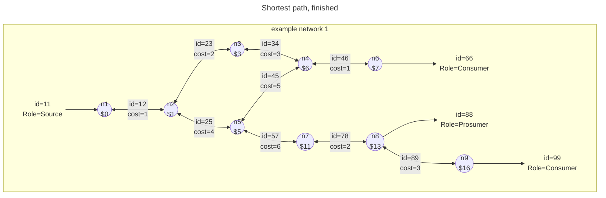

[[./Shortest path or Dijkstra algorithm|previous]] [[./Basic network tracing|next]]
# NetCon Path

Typically, during a trace, it is possible just to return [[../../8 API/Results/Search Or Trace Results/Connections (Result)|Connections (Result)]], and in case the [[./Shortest path or Dijkstra algorithm|previous]] is applied, also the cost at arriving at a connection or node.

In NetCon, [[../../8 API/Results/Search Or Trace Results/Paths (Result)|Paths (Result)]] are returned. In addition to a connection, this provides:
* [[../../8 API/Results/Connection Or Path Results/Depth|Depth]]
* [[../../8 API/Results/Connection Or Path Results/SumCost|SumCost]]
* [[../../8 API/Results/Connection Or Path Results/TraceMarker|TraceMarker]]

The paths that belong to graph below are:

Simple path notation, *not* used in NetCon:

| FromId | In between | ToId | Depth | SumCost | TraceMarker |
| ------ | ---------- | ---- | ----- | ------- | ----------- |
| 1      | -          | 2    | 1     | 1       | Start       |
| 1      | -2-        | 3    | 2     | 3       | -           |
| 1      | -2-        | 5    | 2     | 5       | -           |
| 1      | -2-3-      | 4    | 3     | 6       | -           |
| 1      | -2-3-4-    | 6    | 4     | 7       | End         |
| 1      | -2-5-      | 7    | 3     | 11      | -           |
| 1      | -2-5-7-    | 8    | 4     | 13      | End         |
| 1      | -2-5-7-8-  | 9    | 5     | 16      | End         |
## NetCon Path notation

Instead of having an arbitrary length 'in between' attribute, in NetCon, the paths refer to a **previous** path in a trace to arrive at the outcome with the [[../../8 API/Results/Connection Or Path Results/PreviousId|PreviousId]].
Also, if 'some asset' is present at a node, they are inserted as [[../../8 API/Results/Connection Or Path Results/EdgeType|self-loops]], i.e. going from and to the same NodeId.
This way, we can insert them when encountered at the start, during or at the end of a trace.
For simplicity, in the example provided, let the connection between two nodes have the id that is made up from putting the two NodeIds together, e.g. the connection from n3 to n4 has an id=34.
The same table now looks like this:

| LastConnectionId | PreviousId | FromId | ToId | Depth | SumCost | TraceMarker |
| ---------------- | ---------- | ------ | ---- | ----- | ------- | ----------- |
| 11               | -          | 1      | 1    | 1     | 0       | Start       |
| 12               | 11         | 1      | 2    | 2     | 1       | -           |
| 23               | 12         | 1      | 3    | 3     | 3       | -           |
| 25               | 12         | 1      | 5    | 3     | 5       | -           |
| 34               | 23         | 1      | 4    | 4     | 6       | -           |
| 46               | 34         | 1      | 6    | 5     | 7       | -           |
| 66               | 46         | 1      | 6    | 6     | 7       | End         |
| ***45***             | ***25***       | ***1***    | ***4***  | ***4***   | ***10***    | -           |
| 57               | 25         | 1      | 7    | 4     | 11      | -           |
| 78               | 57         | 1      | 8    | 5     | 13      | -           |
| 88               | 78         | 1      | 8    | 6     | 13      | End         |
| 89               | ***88***   | 1      | 9    | 7     | 16      | -           |
| 89               | 99         | 1      | 9    | 8     | 16      | End         |
Several observations can be made:
* The connections at the start and end are inserted as [[../../8 API/Results/Connection Or Path Results/EdgeType|self-loops]];
	* This increases the depth compared to the simple path notation used before;
* The connection Id=45 is also modelled as a path, with a SumCost of 10, even though it may not be used in a shorted path;
	* It may still be of interested in NetCon output:
		* For a start, mazed networks behave different and need to be operated in a different way;
		* It is still transporting the commodity and as such is *live*;
* The connection at n8 is inserted as a self-loop into the path leading to n9 - here the PreviousId=88 and not PreviousId=78;
	* Basically, if self-loops are encountered on the way, they *have* to be used (unless those are [[./Basic network tracing#Block criteria|blocked]] of course);
	* This increases the depth, and may increase the cost.
