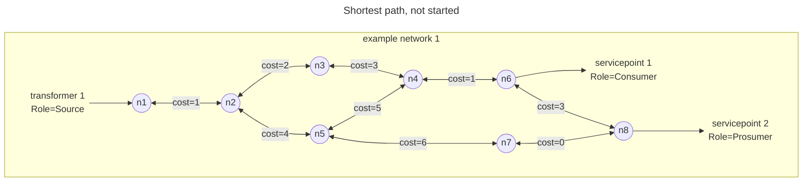
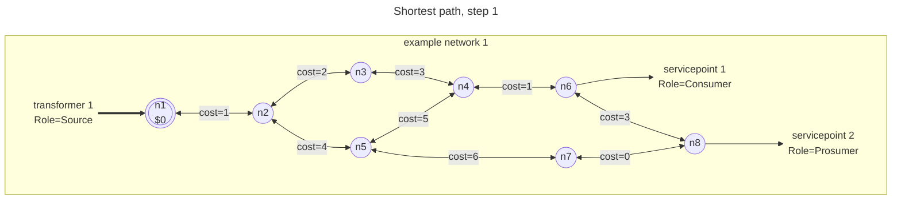
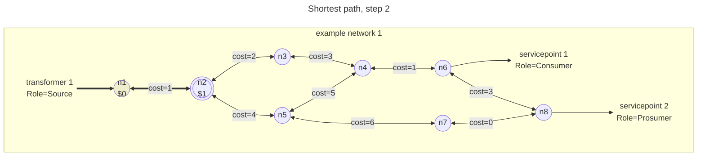
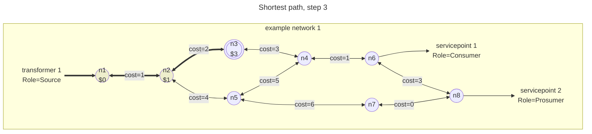
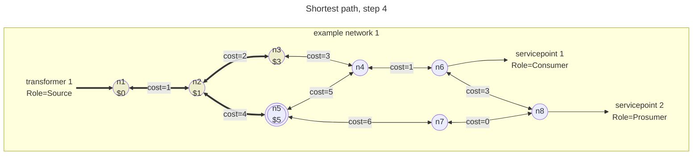
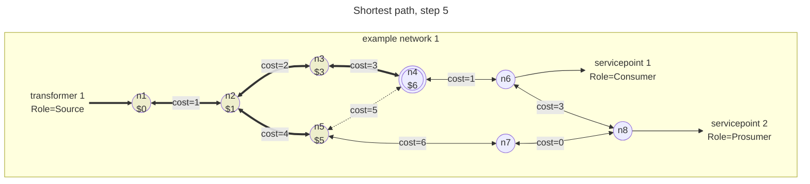
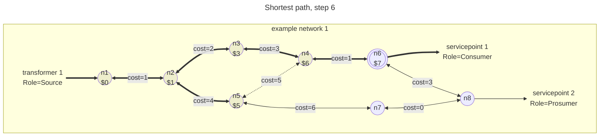
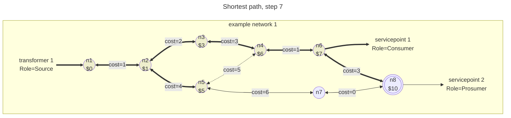
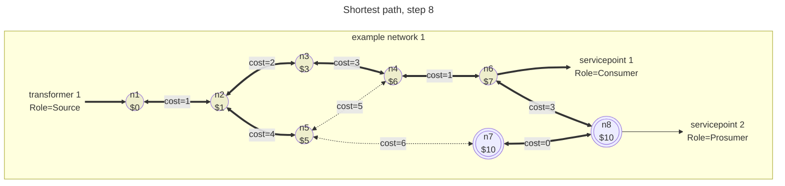
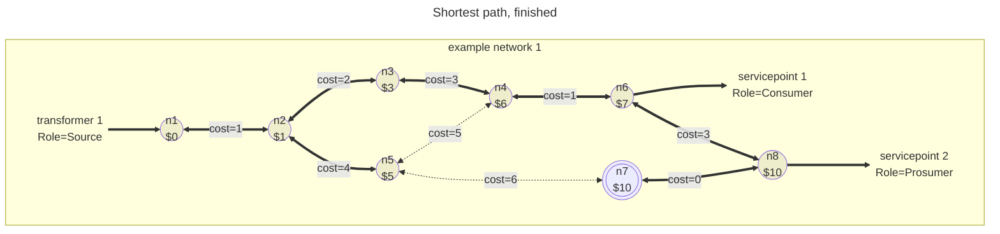

[[../Network Ontology|previous]] [[./NetCon Path|next]]
# Shortest path or Dijkstra algorithm

Excellent explanations can be easily found on the internet, e.g. [on wikipedia](https://en.wikipedia.org/wiki/Dijkstra%27s_algorithm).

Here we will show the shortest paths for an example network that is slight adopted from the one used in [[./Basic network tracing|Basic network tracing]] in order to illustrate the behaviour.

We start at the [[../Sources|Source]], which is connected to n1. The cost will be $0.

In the second step, we look at all the candidates. There is only one: we can travel to n2 with a cost of 1. Hence, the cost of going to n2 is $1.

In the thirth step, we have two candidate. It takes $3 to go to n3, and it takes $5 to go to n5. The shortest path algorithm dictates that we always take the minimum. That is the only guarantee to arrive at minimal costs at the target (aka sink).
By the way, in NetCon the sink is not known at the start of the trace; instead, it is denoted by a predicate, which will satisfy a condition to stop at or yield a result.

In the fourth step, we have two candidates again. The previous candidate still exists, and since we have added n3, all the nodes we can travel to from there are considered. The new candidate is to arrive at n4 for $6, so we take the other one instead.

At step five, we have two candidates to arrive at n4, and one to got to n7. We take the minimum again.

The remaining steps are straightforward; there is not much too choose in this network, apart from the last step.

