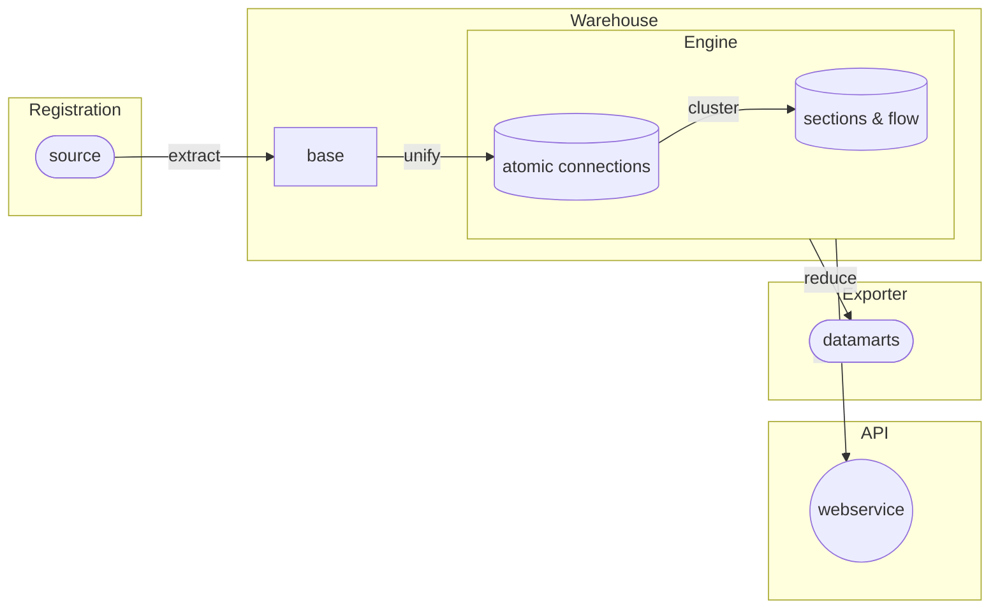

[[./Download and Install NetCon|previous]] [[../5 Configuration/Extraction/Connectivity Extraction from Smallworld|next]]
# Connectivity Extraction Process

## Extract Transform Load flow

Spatial Eye NetCon consists of several steps in which the information is processed:

Each of the steps has its own purpose and associated components:

|                   | 1. Extraction       | 2. Graph Model             | 3. Section graph(s)                                                | 4. Data Mart(s)                                                        |
| ----------------- | ------------------- | -------------------------- | ------------------------------------------------------------------ | ---------------------------------------------------------------------- |
| **Model**         | Base Model [^1]     | [[../5 Configuration/Warehouse/Atomic model|Atomic model]]           | [[../5 Configuration/Warehouse/Section Model|Section Model]]                                                  | Derived or Aggregation Model                                           |
| **Purpose**       | Gather connectivity | Structure all connectivity | Performance increase and reason logic                              | Prepare output for specific purpose                                    |
| **Configuration** | Base Configuration  | Fixed NetCon Model         | Fixed Section Model and optional additional sections Configuration | Flow Calculation, CIM, Data Quality, KPI's, etc. export configurations |
## Registration specific connectivity extraction 

In principle any system that contains connectivity (aka topology) can be used as a source.

These systems are supported in particular:
* [[../5 Configuration/Extraction/Connectivity Extraction from Smallworld|Smallworld]]
* [[Connectivity Extraction from Utility Network Model|UNM]]

Please don't hesitate to contact us if you have another system, e.g. Intergraph.

[1] We will try to make the base extraction redundant, to have a higher performance extracting the connectivity.