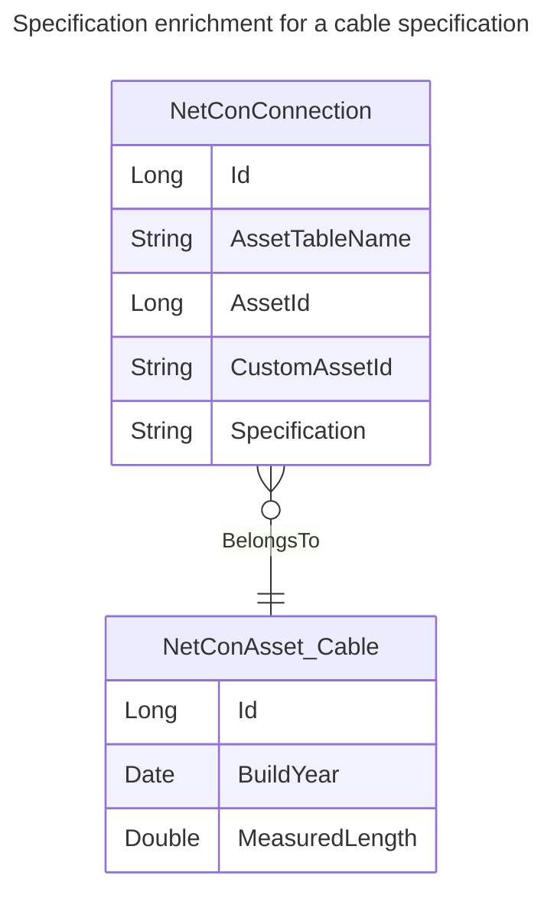

# Asset Enrichment

For each collection that is referenced by `AssetTableName` in the connection model, one can specify additional attributes that will be injected last minuted in the trace results.
For example, one can fetch the yearly power consumption of a service point.
Or, for a telecoms network, the state of a modem.
Or, for a cable, the build year.

In order to configure last minute data enrichment for assets, create a business collection with the name: `NetConAsset <asset_table_name>` where \<asset_table_name> matches the name refered by in the NetConConnection table.

The business collection that provides enrichment data should have its key field, often `id`, of type `long`, as the first field.
Besides that, there can be 1-n additional fields specified. Supported types are string, numeric types, date time or time span.

## Memory efficiency

Note that when in the base extraction [[../../8 API/Results/Connection Or Path Results/Specification|Specification]] and/or [[../../8 API/Results/Connection Or Path Results/AssetHierarchy|AssetHierarchy]] are not supplied, these columns can be added during the [[Asset Enrichment|Asset Enrichment]], last minute.
These freshly added Specifications and AssetHierachies can be enriched in turn, as well.

Each Specification and AssetHierarchy is stored only once, so it is much faster to load additional data using those enrichments.
An additional benefit is that this will use less memory as well.
Therefore, use the asset specific enrichment only for items that are different per asset (such as build year), and not for generic/grouped data (such as manufacturer or enclosing station).

E_NetConConnection table:

| Id  | AssetTableName | AssetId | ... |
| --- | -------------- | ------- | --- |
| 1   | Cable          | 11      |     |
| 4   | Cable          | 44      |     |

NetConAsset Cable table:

| Id  | BuildYear | MeasuredLength |
| --- | --------- | -------------- |
| 1   | 30-9-1971 | 314.159        |

The resulting data is stored efficiently, and looks like this:

| Id  | AssetTableName | AssetId | ... | BuildYear | MeasuredLength |
| --- | -------------- | ------- | --- | --------- | -------------- |
| 1   | Cable          | 11      |     | 30-9-1971 | 314.159        |
| 4   | Cable          | 44      |     |           |                |

In [[../../7 NetConQL/NetConQL - Network Connection Query Language|NetConQL]], the properties of a connection can be queried as follows:

	BLOCK BuildYear<31.12.1999
