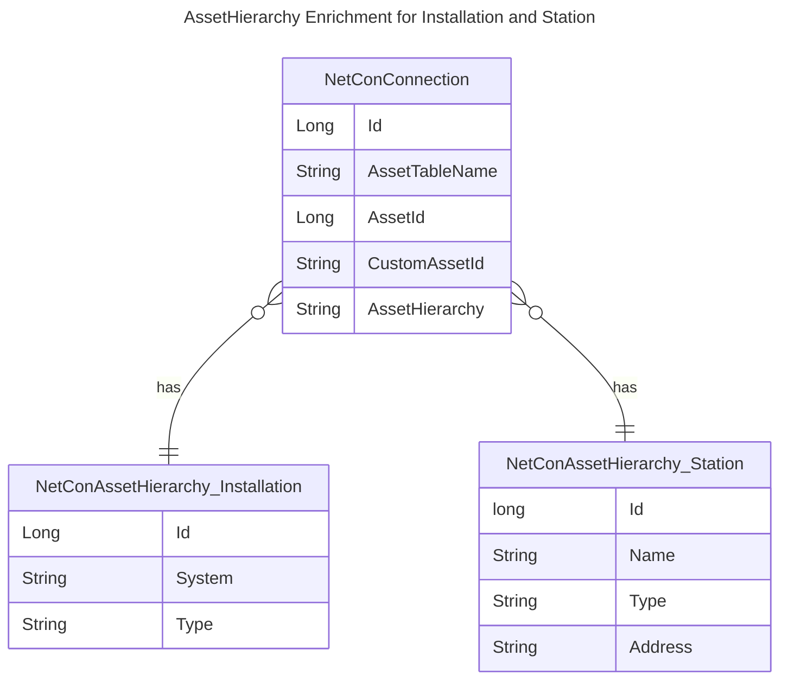

# Asset Hierarchy Enrichment

See also [[../../8 API/Results/Connection Or Path Results/AssetHierarchy|AssetHierarchy]].

For each items that occurs in the `AssetHierarchy` in the connection model, one can specify additional attributes that will become part of that asset hierarchy reference.

For example, if the asset hierarchy is 'installation.id=123, station.id=456', one can specify a system for the installation and a name for the substation. With those enrichments, the asset hierarchy changes to 'installation.id=123, installation.system="lowersidebus", station.id=456, station.name="Holyfield"'.

The asset hierarchy enrichment data is read on startup of the NetConTrace feature source and is stored only once.

In order to configure data enrichment for asset hierarchy items, create a business collection with the name: `NetConAssetHierarchy <asset_table_name>` where <asset_table_name> matches the name refered by in the NetConConnection table.

The business collection that provides enrichment data should have its key field first, often `id` (which must the name used in the asset hierarchy), of type `integer`.
Besides that, there can be 1...n additional fields specified. Supported types are string, numeric types, date time or time span.

## Example

E_NetConConnection table:

| Id  | AssetTableName | AssetId | ... | AssetHierarchy                      |
| --- | -------------- | ------- | --- | ----------------------------------- |
| 1   | BusBar         | 11      |     | installation.id=123, station.id=456 |
| 2   | BusBar         | 12      |     | installation.id=123, station.id=456 |

NetConAssetHierarchy Installation table:

| Id  | System       | Type   | ... |
| --- | ------------ | ------ | --- |
| 123 | lowersidebus | Single |     |

NetConAssetHierarchy station table:

| Id  | Name      | Type       | Address          | ... |
| --- | --------- | ---------- | ---------------- | --- |
| 456 | Holyfield | SubStation | Strawberryhill 7 |     |

The resulting data is stored efficiently, and looks like this:

| Id  | AssetTableName | AssetId | ... | AssetHierarchy                                                                                                                 |
| --- | -------------- | ------- | --- | ------------------------------------------------------------------------------------------------------------------------------ |
| 1   | BusBar         | 11      |     | installation {id 123, System "lowersidebus", type "Single"}, substation {id 456, Name "Holyfield", Address "Strawberryhill 7"} |
| 2   | BusBar         | 12      |     | installation {id 123, System "lowersidebus", type "Single"}, substation {id 456, Name "Holyfield", Address "Strawberryhill 7"} |

In [[../../7 NetConQL/NetConQL - Network Connection Query Language|NetConQL]], the properties of a connection can be queried as follows:

	WHERE AssetHierarchy->installation->Id=123

or

	STOP AssetHierarchy->substation->Name="Holifield"

or

	BLOCK AssetHierarchy->substation->Adress="*berry*"
