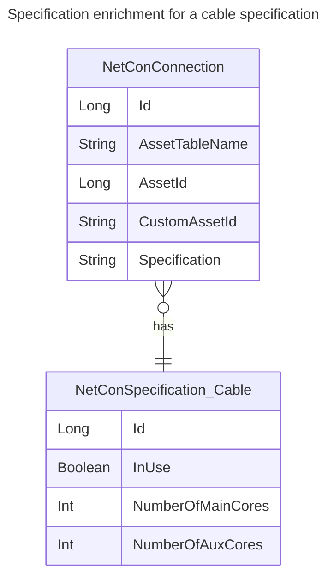
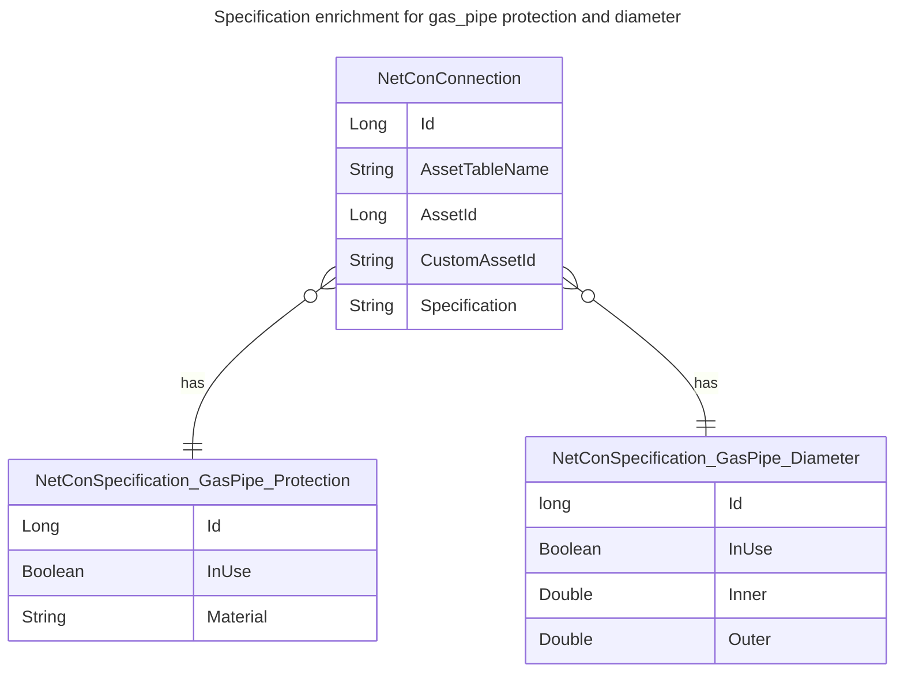

# Specification Enrichment

See also [[../../8 API/Results/Connection Or Path Results/Specification|Specification]].

For each items that occurs in the `Specification` field in the connection model, one can specify additional attributes that will become part of that specification.

For example, if the specification is '4637', one can specify a type that changes this to 'id=4637,numberofmaincores=4'.
Another example is that 'protection.id=777,diameter.id=7' is changed to 'protection.id=777,protection.material="HDPE",diameter.id=7,diameter.inner=900'.

The specification enrichment data is read on startup of the NetConTrace feature source and is stored only once.

In order to configure data enrichment for specification items, create a business collection with the name: `NetConSpecification <asset_table_name>` where <asset_table_name> matches the name referenced by in the NetConConnection table in the asset table field. If more than one specification table is in use for a single table, the tables should be named `NetConSpecification <asset_table_name> <specification>`.

_ToDo: Note that looking up enriched information for multiple specifications is not yet implemented. It is supported to have them stored already._

In the example above, one could have two tables named `NetConSpecification gas_pipe protection` and `NetConSpecification gas_pipe diameter`.

The business collection that provides enrichment data should have its key field first, often `id` (which must the name used in the asset hierarchy), of type `integer`.
Besides that, there can be 1...n additional fields specified. Supported types are string, numeric types, date time or time span.

## Example 1

E_NetConConnection table:

| Id  | AssetTableName | AssetId | ... | Specification |
| --- | -------------- | ------- | --- | ------------- |
| 1   | Cable          | 11      |     | 4637          |
| 4   | Cable          | 44      |     | id=4637       |

NetConSpecification Cable table:

| Id   | InUse | NumberOfMainCores | NumberOfAuxCores | MainCoreDiameter | MainCoreMaterial | AuxCoreDiameter | AuxCoreMaterial |
| ---- | ----- | ----------------- | ---------------- | ---------------- | ---------------- | --------------- | --------------- |
| 4637 | True  | 4                 | 4                | 60               | AL               | 8               | AL              |

The resulting data is stored efficiently, and looks like this:

| Id  | AssetTableName | AssetId | ... | Specification                                                                                                                                        |
| --- | -------------- | ------- | --- | ---------------------------------------------------------------------------------------------------------------------------------------------------- |
| 1   | Cable          | 11      |     | [4637 777, InUse True, NumberOfMainCores 4, NumberOfAuxCores 4, MainCoreDiameter 60, MainCoreMaterial "AL", AuxCoreDiameter 8, AuxCoreMaterial "AL"] |
| 4   | Cable          | 44      |     | [4637 777, InUse True, NumberOfMainCores 4, NumberOfAuxCores 4, MainCoreDiameter 60, MainCoreMaterial "AL", AuxCoreDiameter 8, AuxCoreMaterial "AL"] |

In [[../../7 NetConQL/NetConQL - Network Connection Query Language|NetConQL]], the properties of a connection can be queried as follows:

	WHERE Specification->Id=4637

or

	STOP Specification->(NumberOfMainCores=4 AND NumberOfAuxCores=4)

or

	BLOCK Specification->MainCoreMaterial="AL*"

## Example 2

G_NetConConnection table:

| Id  | AssetTableName | AssetId | ... | Specification                   |
| --- | -------------- | ------- | --- | ------------------------------- |
| 2   | GasPipe        | 22      |     | protection.id=777,diameter.id=7 |
| 3   | GasPipe        | 33      |     | protection.id=777,diameter.id=7 |

NetConSpecification GasPipe Protection table:

| Id  | InUse | Material | ... |
| --- | ----- | -------- | --- |
| 777 | True  | HDPE     |     |

NetConSpecification GasPipe Diameter table:

| Id  | InUse | Inner | Outer | ... |
| --- | ----- | ----- | ----- | --- |
| 7   | False | 0.900 | 0.980 |     |

The resulting data is stored efficiently, and looks like this:

| Id  | AssetTableName | AssetId | ... | Specification                                                                                          |
| --- | -------------- | ------- | --- | ------------------------------------------------------------------------------------------------------ |
| 2   | GasPipe        | 11      |     | protection {id 777, InUse True, Material "HDPE"}, diameter {id 7, InUse False, Innter 0.9 Outer 0.98"} |
| 3   | GasPipe        | 12      |     | protection {id 777, InUse True, Material "HDPE"}, diameter {id 7, InUse False, Innter 0.9 Outer 0.98"} |

In [[../../7 NetConQL/NetConQL - Network Connection Query Language|NetConQL]], the properties of a connection can be queried as follows:

	WHERE Specification->Diameter->Id=7

or

	STOP Specification->Diameter->(Inner>500 OR Outer>600)

or

	BLOCK Specification->Protection->Material="*PE"
