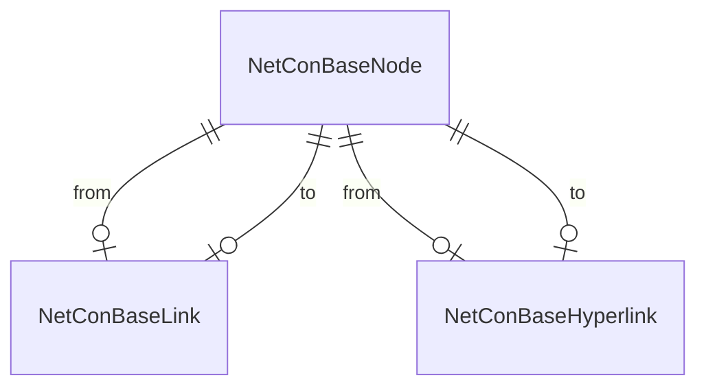
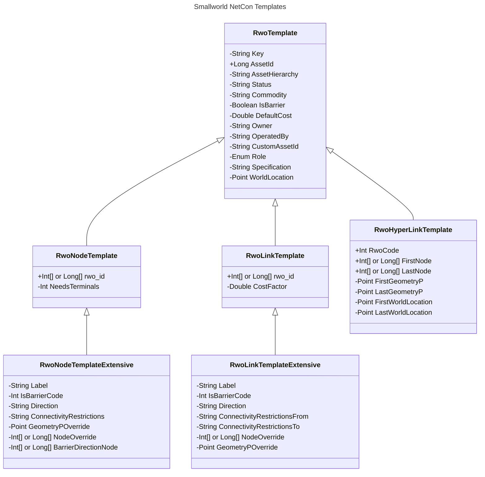

# Connectivity Extraction from Smallworld

The purpose of the base extraction is to get the connectivity data from a source. Its output tables are transformed into a standardized connectivity model and should not be used directly, not for any other purpose. The approach has been standardized for Smallworld. Additional standard extractions can be provided for other sources.

Spatial Eye provides a template configuration to extract network connectivity from Smallworld configurations. To get started, it is handy to know:

- What is the discipline you are going to model? It is good to decide on a prefix for you model, typically one uses 'E' for electricity, 'G' for gas, 'T' for telecom, 'W' for water, 'S' for sewage, 'H' for heath. For convenience, below we will assume 'E'.
- What is the coordinate system that is used to acquire the data? This could potentially be different from the coordinate system that is used to tag the database. For example, in the Netherlands, the Smallworld CS used for tagging is 'Niederlande mm' but all data is acquired and loaded via the EPSG CS 'Amersfoort RD new'. Hence, the latter is used to interpret the data. This is an exception though, most of the time the CS will be set correctly.
- Internal world configurations: What objects own an internal world and how are worldids made up? For example a substation and a distribution point could both be a world owner that contain an internal world with connectivity information. The world information is used to scale and project the connectivity to the outside world. For example, you may have a table called substation whose internal worlds are described as `"3524"+substation.id.toString()` or as `format("substation({0})", substation.id)`.
- What part of the connectivity is not part of the manifolds, but inside and between real-world objects? This will be modelled as hyperlinks.

The first step is to query the [Geom Attribute Definition](Connectivity%2520Extraction%2520from%2520Smallworld.md##geom-attribute-definition) helper table. This will provide a list of geometries that are part of a network topology and hence are candidates to be processed.

In the template project that is provided to configure a Smallworld base extraction, a number of Business Collection Interfaces have been defined as templates that can be copied and hooked up and mapped to input feature collections. These are:

| Business Collection Interface | Purpose |
| --- | --- |
| RwoNode template | Business Collection template for standard node/point objects.
| RwoNode template_extensive | Business Collection template for complex node/point objects.
| RwoLink template | Business Collection template for standard link/curve objects.
| RwoLink template_extensive | Business Collection template for complex link/curve objects.
| RwoHyperLink template | Business Collection template for extracting connectivity relations.

It is strongly recommended that for every business collection that is configured, a template is used as a start. It is not required to map every interface field of the template.

In this file, you'll find a collection called 'E_GeomAttributeDefinition' which you can evaluate to see all the tables that are part of the Smallworld topology network and which can be mapped. When a table is mapped you create a business collection called:

- `E RwoNode <tablename>`
- `E RwoNode <tablename>(<suffix>)`
- `E RwoLink <tablename>`
- `E RwoLink <tablename>(<suffix>)`
- `E RwoHyperLink <tablename>`

Note that `<tablename>` will be stored in the AssetTableName field of the extracted topology.
The syntax with `(<suffix>)` is used to be able to use several business collections to extract information for the same tablename. The suffix is just a comment. E.g. One can have low voltage cables extracted from an in-place as well as a route (trench) model.

If you decide to excluded a table from the connectivity model, it is best practice that you still create the appropriate table for it and rename it. This way it is clear that it was not forgotten but excluded on purpose. Note that excluding tables may create holes in your connectivity.

- `E ExclNode <tablename>`
- `E ExclLink <tablename>`

 Typically excluded are:

- Height points;
- Dimensioning (if topologically connected);
- Substation buildings;
- Schematic objects.

Below we will describe the extraction templates provided.
Note that in this description, a '+' means the field is obligatory, and a '-' means it is optional. If you can provides optional fields, when the data is there, it is best to do so to create a rich connectivity model.

In these templates you see that certain fields, such as rwo_id and node_id, can be either arrays of the int or long datatype. Whether this is an int or long array depends if extended UVA function is loaded in the Smallworld data model.

Many Smallworld databases are created and populated in a straight way. As a result for, the array key values the first 2 items are always the same. If this is the case for your database, you can just use the third key only, which is faster. This is the default.

In case you database needs to use the full keys, add an environment variable to your configuration:

    REM Environment Variables
    SET NETCON_SWEXTKEY=T``

Explanation about how the template fields in the diagram will work:

- Rwo_id: Relation field to the topology model. Every asset (realworld object) that is part of network connectivity will have this field.
- DefaultCost: Defaults to 0.0 for a node and to the length of a geometry. Note that the geometry of an asset will be split and divided per link.
- CostFactor: In case the geometrical length of the asset is not correct, specify the `MeasureLength / GeometryL.Length`. This way, the additional length will be equally distributed over the individual links.
- Status: Is typically an enumerated string. These need to be mapped to StatusCode in the output tables in order to arrive at a lifecycle status dimension. See also _ToDo_.
- IsBarrier: true when it is barring, false when the commodity is passing through, null otherwise.
- IsBarrierCode: more precise alternative to IsBarrier. 0 when this it always conducting, 1 when it is barring, -1 when passing through, -2 when passing through a tiny bit to keep the flow going, -10 when this is machine operated, state unknown/unregistered here.
- Direction: When null, it is bidirectional, when 'F-L' (first to last), it is going from the first node to the last, when it is 'L-F' (last to first) then the first node and last node will be swapped, such that in the NetConConnection table, the flow will always be from the first node to the last node.
  For direction to work on a node (e.g. a 'keerklep'), it will need to have Terminals.
- ConnectivityRestrictions: If provided, then, in the extracted model, not everything connecting to a single node will be connected. Instead, within that node, only those part sharing the same 'ConnectivityRestrictions' is connected. In the NetConConnection this will be expanded to individual nodes for every combination. This is useful for the following situations:
  - Cables in routes or trenches: No everything connected by geometry is connected in reality. Additional information about what is connected is used to separate out the different cables, as expressed by 'ConnectivityRestrictions'.
  - Combination cables, e.g. where low voltage and street light are combined into a single physical cable but need to be separated out into several functional cables. Another example are high voltage cables that contain something else.
- ConnectivityRestrictionsFrom and ConnectivityRestrictionsTo: Same as ConnectivityRestrictions, but applied to the from or to nodes of a link.
- NeedsTerminals: Will be set automatically for node objects that can be barring. A value of 1 will have terminals generated. A value of 2 will, ensure, in addition, if several objects are on top of each other, each will be assigned its own node. That way, the objects that are enclosed with terminals will not share the same node.
- Role: Is whether this node or link is producing, consuming the Commodity, or both. Examples are a power plant or HV-transformer, an industry or household, or a battery. Role values are 0=Unknown, 1=Transport, 2=Producer, 4=Consumer, 6=Prosumer. Defaults to 0.
- WorldLocation: Point location of the world owner in the outside world. If provided, the geometry of the node or link asset will be scaled and relocated to this. In case one has world in worlds, the WorldLocation can be pre-relocated to handle the position of the intermediate world owners. Examples for this are available.
- Key: Every object in the NetCon connection table must be unique. It will be assigned a new Id based on the AssetId or Key supplied. In case AssetId is not sufficient to make the business object unique, one can combine all keys in a string-based key-field. This allows for expanding of objects (a route or trench), or unfolding of objects that have several functions at the same time (combination cables). An example is: `Concat(ELvTrenchJoint.id, "|", LsOvFunctions.Key)`.
- GeometryPOverride: Geometry position to use instead the one of the point found in the topology tables.
- NodeOverride: Advanced function. _ToDo_
- BarrierDirectionNode: Advanced function. _ToDo_
- ChainOverride: Advanced function. _ToDo_
- RwoCode: For hyperlinks only. This value must be a negative integer. It is used to identify which hyperlink business object generated this. Thus, each hyperlink definition must have its own value.
- FirstNode and LastNode: For hyperlinks only. Id of the topology node in Smallworld.
- FirstGeometryP and LastGeometryP: For hyperlinks only. Start and end point geometry, respectively. If specified, a line geometry will be generated between these two points (after transformation). If not specified, the hyperlink will not have a geometry.
- FirstWorldLocation and LastWorldLocation: For hyperlinks only. As WorldLocation, for FirstGeometryP and for LastGeometryP, which can reside in different worlds.

Other items that you will need to check in the base extraction file in the [NetConBase Output business objects](Connectivity%2520Extraction%2520from%2520Smallworld.md##netconbase-output-tables):

- Ensure all the stati (statusses) are mapped to values;
- Set the coordinate systems for the geometries that are generated.
- If the coordinate system is not the same Smallworld CS as stored in the VMDS file, but e.g. a EPSG CS, then provide a conversion factor. E.g. if you Smallworld CS is in mm or cm, and the EPSG is in m (meter), then you need to set `ext_scale_factor` to 0.001 or 0.01 respectively.
- Provide a world scale factor for rescaling internal world geometries to the external world. Typical values for the `world_scale_factor` range between 0.05 and 0.0001.

Finally the base extraction configuration contains a number of pre-configured enumerator tables. These are listed in [NetConBase Output tables](Connectivity%2520Extraction%2520from%2520Smallworld.md.md##netconbase-output-tables).

For certain Smallworld registrations, extra tooling is available, see [[./Enhanced Connectivity Extraction from Smallworld|Enhanced Connectivity Extraction from Smallworld]].