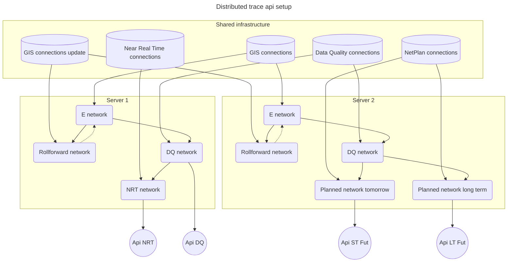

[[./Stacked Overlay Networks|previous]]
# Distribute Overlay Networks Architecture

Overlay networks can run on one and the same or separated servers.
In case the load becomes too much, they can be separated out.
For example, the Near Real Time network and Planned network can get their own servers respectively.

