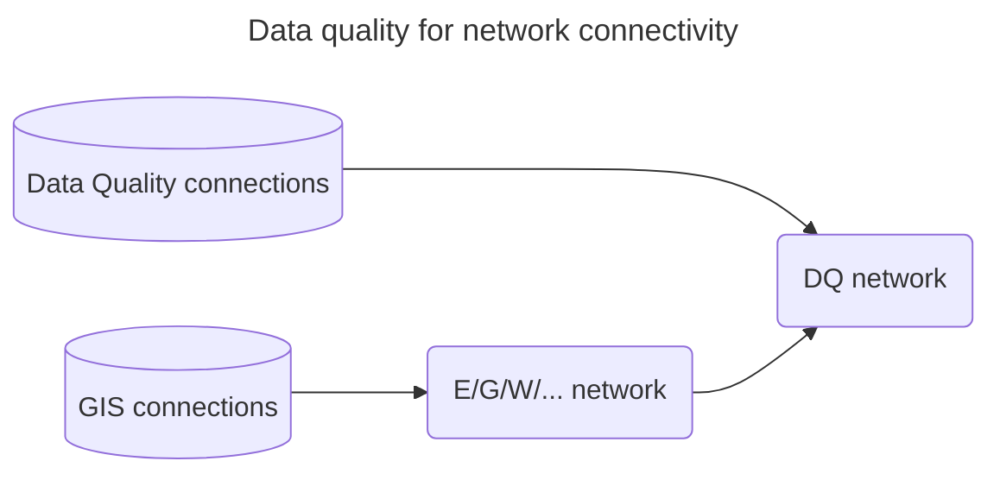

[[./Overlay Networks for Data Quality|next]]
# Introduction to Overlay Networks

An overlay network is a network on top of another network, called the underlying network.
It takes in removals of existing connections, updates and new connections.

> [!Info] Overlay Networks handle differences
> Overlay Networks provide a mechanism for dealing with differences, sometimes called the 'delta', between networks.
> The Overlay Network only contains the differences and points to the underlying network. This saves space at the cost of some lookup overhead.
> This makes it is possible to create a temporary Overlay Network for just one query result.

A typical application of an Overlay Network is:
* Data Quality patches: Improve on data quality problems for which a fix is required immediately, and eventually need to be fixed in the source;

