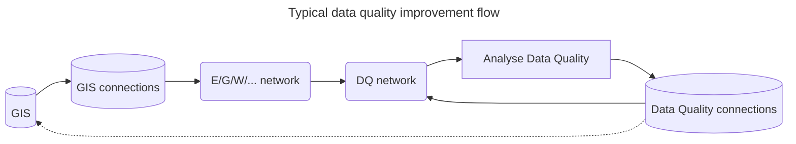

[[./Introduction to Overlay Networks|previous]] [[./Stacked Overlay Networks|next]]
# Overlay Networks for Data Quality

> [!Tip] Data quality patches should not replace the GIS
> On a regular basis, the data quality patches need to be fed back into the GIS, which is the source of truth for connections coming from Assets.
> Patches that have been processed, need to be removed from the Overlay Network.

Data quality patches are created when during network analysis problems are found and temporarily fixed.
For example, typically, when doing a flow calculation, islands in the network are not allowed.
Also, the default barrier state needs to such that all the network is fed - it is unrealistic that in the default states customers are not serviced.

In the configuration, the network and overlay network are modeled as follows (example):

|                              | Normal network              | Overlay network      |
| ---------------------------- | --------------------------- | -------------------- |
| Feature source               | Trace E                     | Trace E DQ           |
| Network name                 | E                           | EDQ                  |
| Underlying network           |                             | E                    |
| Readonly connection name     | ENetConConnection           |                      |
| Writable connection name     |                             | ENetConConnectionNRT |
| Directionalize               | Yes if traced, no otherwise | Yes                  |
| Generate isolatable sections | No                          | Yes                  |
| Generate operated sections   | No                          | Yes                  |
| Generate indices             | Yes if traced, no otherwise | Yes                  |

