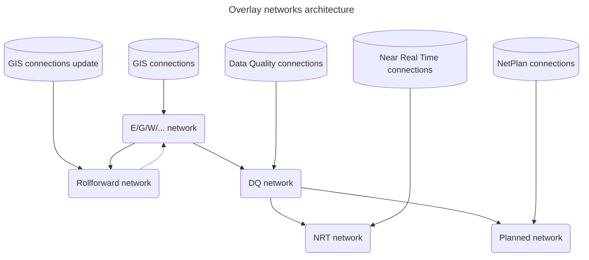

[[./Overlay Networks for Data Quality|previous]] [[./Distribute Overlay Networks Architecture|next]]
# Stacked Overlay Networks

> [!Tip] Overlay Networks can be stacked
> It is possible to have an Overlay Network on top of another Overlay Network, just as well as on top of a normal Network. 

Other examples of Overlay Networks applications are:
* Network reductions (morphing graph structures into equivalent or subsets)
* Near Real Time barrier status;
* NetPlan future network plans;
* Periodic roll forward to do an update of the connections registered in the GIS.

These examples can all occur at the same time; if so, their relationship and data flow is as follows:

