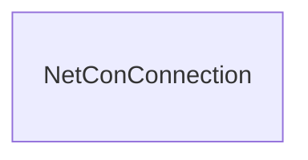

# Atomic model

The word atom means 'indivisible' or 'un-cuttable.' In NetCon this word has been chosen to denote the finest level of detail of storing connectivity. Every element in it has a unique key: both for the connection and the node ids. Hence, the atomic model is the foundation for feeding other systems, because with these unique keys at hand, an exporter does not need to invent new keys in the process.

Some may call the atomic model 'primary' to denote its foundational character.

Of course, for storage and performance reasons, we do not want to make the atomic larger than necessary; hence when specifying the input, the [needs_terminals](Atomic%2520model.md##network-ontology) should be used sparingly.

See also [[../Extraction/Atomic Model configuration|Atomic Model configuration]].
