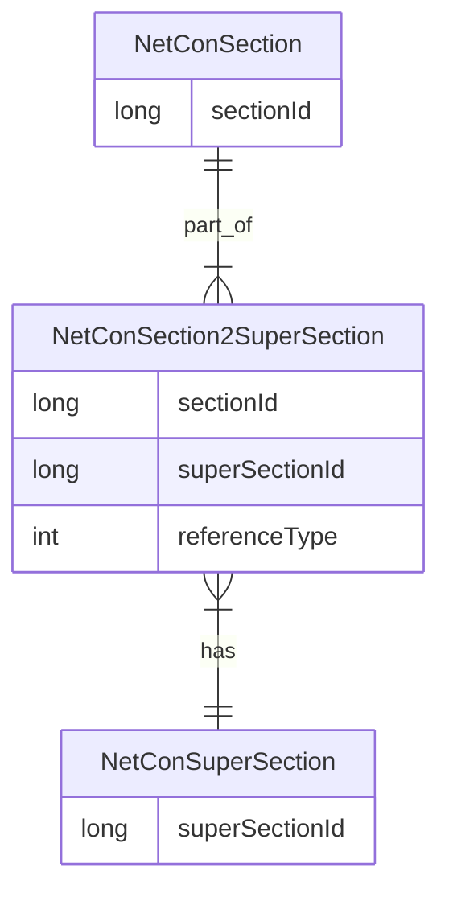
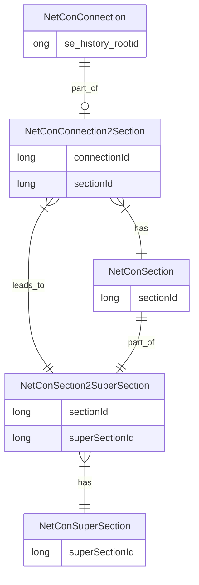

# Operated Sections

When the standard isolatable sections are generated, it is also possible, at the same time, to generate other - higher order - aggregations.

One example of high order aggregations is the Operated Section, also known as Super Section. It consists of Isolatable Sections that are all connected by how the network is currently operated, i.e. which barriers are conducting and which ones are barring. This is often called the default or normal operating state. So, every connection in the Operated Section receives the commodity, or none do, because the barriers in the Operated Section are all conducting (passing on the flow, energy, water, or data).

A compatibility option is provided (now deprecated). One can specify if Isolated Sections that are clustering the network and become Operated Sections, that  should be distributed to their neighbor Operated Sections. For example, this way, a transformer splitting the LV network from the MV/HF - which is not really an operable barrier but does define this split, can be part of the downstream and upstream Operated Section. Since this complicated the data model, this option is now deprecated.
The value referenceType is '0' when a barrier that makes up a Isolated Section is allocated to its own OperatedSection. Filtered on '0' every Isolated Section is part of only one Operated Section. For those distributed to their neighbors, the referenceType equals '1'.
See also 'CopyCutterToNeighbours'. (ToDo).

For normal behavior, i.e. referenceType always equals '0', the cardinality for this is shown in the next diagram.

One can directly combine the two relationship tables in order to find the connections in the Operated Section:

The Super Section Id of the Operated Section can be used to colorize the connections. This way, one get a good view how the network is currently operated.

Example operated sections of an electricity network with NetCon
![[../../Zimages/operated_sections_in_elec_network.png|operated_sections_in_elec_network.png]]

The Super Section Id comes in particularly handy when trying to understand what happens in complex situations, such as a schematic substation that is connected to the outside world. In the picture below, your can clearly see how the low voltage network at the bottom is connected to the tertiary transformer windings, that are directly fed from the high voltage network coming it at the top. The medium voltage is fed by the secondary windings and its busbars are drawn at the right.

Example hyperlinks in an electricity network connecting the geographical and schematic representation with NetCon
![[../../Zimages/operated_sections_elec_schematic_network.png|operated_sections_elec_schematic_network.png]]
