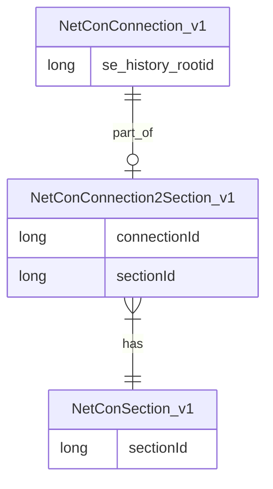

# Section Model

An Isolatable Section if that part of the network that, under normal circumstances, is always operated as a unit. Either it get the commodity (energy, water, data) or it does not, and that holds for all Connections in this section, since they cannot be separated by changing the barriers (for example opening or closing switches or valves). For this all connections in the Section are connected via their from/to nodes.

The configuration of the section model is kept standard for all users of NetCon; it should not be changed.
Not every NetConConnection is used in a section: only the ones that are in operation or in service. These are the ones with statuscode >= 0 and <= 10 (which is: 'unknown' (0), 'in service' (1), upto and including the parts of the network that are planned to be taken out 'decommissioned', but currently still conducting or transporting a commodity).
## Section Model v1

___
The section id of the connection can be used to colorize the network. This way, one can quickly see the reach of the Isolated Section.

Example isolatable sections of a water network with NetCon
![[../../Zimages/sections_in_waternetwork.png|sections_in_waternetwork.png]]

