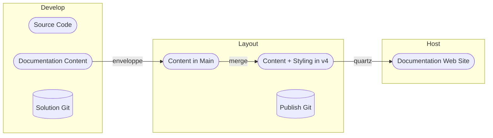

# Documentation Process

The documentation process should be:

* Trustable
* Have the documentation content registered in the git version control with the source code
* Be built on standard components
	* The file format that has been chosen is MarkDown
* Support:
	* Branding
	* Search
	* Translation
	* Reuse of shared content
	* Collaborating
* Scale

The process that has been currently drafted is depicted below:

## Remarks from team discussion

- We need to be able to collaborate or working together. For this we need to agree on how we avoid conflicts.
- Because the documentation is in mark down text format and in Git, conflicts are relatively easy to solve. 
